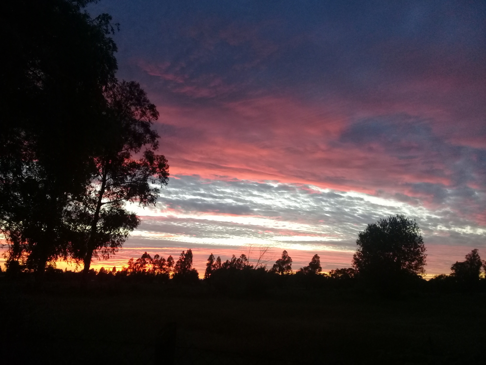

Mi nombre es José Luis Ulloa Fulgeri, soy profesor asistente en la Facultad de Psicología en la Universidad de Talca. Soy bioquímico de formación (Universidad de Chile) pero en algún punto de mi formación me volví un apasionado por el estudio de la conducta humana.

Vivo cerca de Pelarco.

¿Cuáles son mi hobbies, me preguntas?
Amo la música y la literatura.

